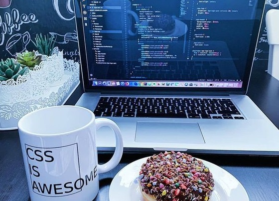

# PORTAFOLIO IV PERIODO 2021

# INFORMACIÓN PERSONAL
Colegio Santa Catalina Laboure  
Karen Sophia Valdés Leonardo  
IV bachillerato en ciencias y letras con orientación en computación  
Materia: Computación (Laboratorio 1)  
Docente: Josué Fuentes  

# ÍNDICE

<ul>
  <li><a href="https://ksvaldes.github.io/SitioWeb/">Inicio</a>
    <ul>
      <li>Portada</li>    
    </ul>
  
  </li>
  <li><a href="https://ksvaldes.github.io/SitioWeb/login">Login1</a>
    <ul>
      <li>Inicio Sesión</li>
    </ul>
  </li>
    <li><a href="https://ksvaldes.github.io/SitioWeb/login2">Login2</a>
    <ul>
      <li>Inicio Sesión</li>
    </ul>
  </li>
      <li><a href="https://ksvaldes.github.io/SitioWeb/Dash">Información</a>
    <ul>
      <li>Datos</li>
    </ul>
  </li>
    </li>
      <li><a href="https://ksvaldes.github.io/SitioWeb/No4">Perfil</a>
    <ul>
      <li>Información</li>
    </ul>
  </li>
  
</ul>

# OBJETIVOS

<ol>
  <li>Hacer que esta página web logre ser responsive al 100%, sin ningún problema.</li>
  <li>Poder realizar un trabajo 100% identico al modelo </li>
  <li>Hacer mi página web atractiva y llamativa para los demás usuarios.</li>
</ol>

# DOCUMENTACIÓN

Entra a este link para ver mi glosario !

Enlace #1
https://ksvaldes.github.io/SitioWeb/

Enlace #2
https://ksvaldes.github.io/SitioWeb/login

Enlace #3
https://ksvaldes.github.io/SitioWeb/login2

Enlace#4
https://ksvaldes.github.io/SitioWeb/Dash

Enlace#5
https://ksvaldes.github.io/SitioWeb/No4

# OBJETIVOS FUTUROS

<ul>
  <li>Quiero poder seguir programando y poder crear muchas cosas agradables para el público.</li>
  <li>Quiero aprender más sobre la programación y poner todos mis conocimientos en práctica.</li>
  <li>Quiero poder ayudar a las demás personas con la ayuda de la programación.</li>
</ul>

